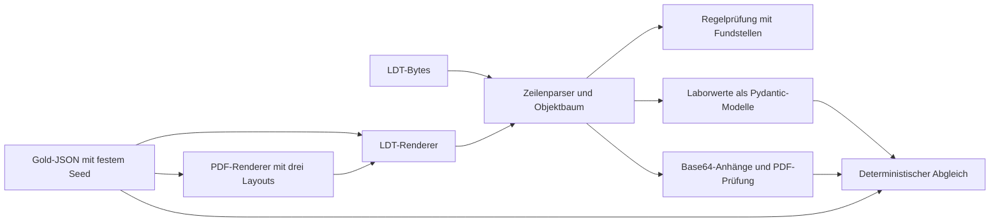

# Lösung: Tag 1 – LDT und synthetische Befunde

Die Lösung von der [ursprünglichen Aufgabenstellung](../README.md).
Code, Tests, Dokumentation und erzeugte Daten liegen in diesem Ordner.
Die bereitgestellten KBV-Dateien und die Spezifikation liegen unter `engineering-hospitation/data/`
und `engineering-hospitation/docs/`. Es werden ausschließlich fiktive KBV- und synthetische Daten verwendet.

## Ergebnisse

### Setup in fünf Befehlen

Im Verzeichnis `loesung/` ausführen (Python 3 mit pip vorausgesetzt):

```sh
python3 -m pip install --user uv
python3 -m uv sync --locked
cp -n .env.example .env
python3 -m uv run pytest
python3 -m uv run python -m src.check_tag1
```

uv stellt Python 3.12 und `.venv` bereit; `uv.lock` fixiert die Abhängigkeiten.
In der IDE `loesung/.venv/bin/python` wählen.

### Stand von Tag 1

- LDT-Zeilenrahmen und Byte-Längen prüfen, ISO-8859-15 dekodieren.
- Satz-/Objektgrenzen prüfen; Reihenfolge, Wiederholungen und Quellzeilen erhalten.
- Relevante Feldpositionen, Vorkommenshierarchien, Pflichtfelder, Werte und
  Kontextregeln prüfen; Abweichungen mit Regel und Fundstelle melden.
- Klinisch-chemische Laborwerte aus `Obj_0060` samt Referenzbereichen und Flags
  extrahieren. Rohwerte einschließlich Komma und Vergleichszeichen bleiben erhalten.
- Eingebettete PDFs objektweise Base64-dekodieren und auf Lesbarkeit prüfen.
- 18 Gold/LDT/PDF-Paare deterministisch erzeugen und gegenprüfen.

Die Regelprüfung ist ein dokumentierter Ausschnitt des LDT-Standards, keine
KBV-Zertifizierung. Die unterstützten Bereiche und verbleibenden Grenzen stehen
unten und in den [Lesenotizen](docs/ldt-notizen.md).

### Architektur



| Datei | Aufgabe |
| --- | --- |
| `src/ldt_sparser.py` | Zeilen und verschachtelte Sätze/Objekte lesen |
| `src/ldt_regeln.py` | Nachgeschlagene Feldhierarchien und Objekttabellen |
| `src/ldt_validator.py` | Validierung mit Regel, Objektpfad und Zeilennummer |
| `src/ldt_extractor.py` | Laborwertmodelle, Extraktion, Anhangsprüfung und CLI |
| `src/generate_dataset.py` | Gold zuerst, dann LDT und PDF erzeugen |
| `src/check_tag1.py` | Gespeicherte Artefakte gegen Gold prüfen, KBV-PDFs extrahieren |

### Nachvollziehbare Prüfzahlen

Ergebnis von `python3 -m uv run python -m src.check_tag1`:

| Prüfung | Ergebnis |
| --- | ---: |
| Synthetische Befunde | 18 |
| Laborwerte | 144 |
| PDF-Layouts | 3 (je 6 Befunde) |
| Mehrseitige Befunde | 3 (insgesamt 21 Seiten) |
| Absichtlich fehlerhafte LDTs | 3, alle erwarteten Fehler erkannt |
| Unerwartete Abweichungen im Gold-Abgleich | 0 |
| KBV-Dateien verarbeitet | 6 |
| KBV-PDFs extrahiert | 5 |
| Klinisch-chemische Werte aus KBV-Dateien | 8 |

Der [Prüfbericht](reports/tag1-pruefung.json) enthält die Ergebnisse je Befund.
Der Abgleich prüft Werte, Einheiten, Referenzen und Flags sowie die bytegenaue
Gleichheit zwischen eingebettetem und separat gespeichertem PDF. Der PDF-Text
wird auf der im Gold angegebenen Seite nach Analyt, Wert und Einheit geprüft;
das ist keine Messung einer unabhängigen PDF-Extraktion. Die Tests überprüfen
zusätzlich byteidentische Neugenerierung in zwei getrennten Verzeichnissen.
**Diese Zahlen sind Tag-1-Konsistenzprüfungen, und keine LLM-Evaluation.**

### Befund verarbeiten

```sh
python3 -m uv run python -m src.ldt_extractor ../data/ldt/kbv-testdaten/Z01_UseCase05_Befund_mitPDF.ldt --output data/extrahiert/Z01_UseCase05_Befund_mitPDF
```

Ausgabe: `ergebnis.json` und `anhang_001.pdf`. Alle sechs KBV-Ergebnisse und
fünf PDFs sind bereits unter [data/extrahiert](data/extrahiert) abgelegt.
PDF-Dateinamen werden lokal vergeben; externe LDT-Dateipfade werden nicht geöffnet.
Mehrere Anhänge werden getrennt behandelt. Ungültige Base64-Daten, beschädigte
PDFs oder unbekannte Ergebnisarten werden gemeldet, nicht still ergänzt.

Nur die Validierung ausführen:

```sh
python3 -m uv run python -m src.ldt_validator data/synthetisch/SYN-016/befund.ldt
```

Der absichtlich fehlerhafte Befund liefert K002 und Exitcode 1. Bei fremder oder
fehlender Version bleiben Abweichungen Prüfhinweise; die JSON-Ausgabe muss also
auch bei Exitcode 0 gelesen werden. `vollstaendig: false` bedeutet ausdrücklich,
dass nicht der gesamte Standard implementiert ist. Ungeprüfte Objekttypen werden
aufgelistet, und `review_erforderlich` signalisiert Befunde mit Prüfmeldungen,
unbekannten Objekttypen, nicht unterstützten Ergebnissen oder Anhangsfehlern.

### Synthetischer Datensatz

[data/synthetisch](data/synthetisch) enthält pro `SYN-001` bis `SYN-018`:
`gold.json`, `befund.ldt` und `befund.pdf`. Das Manifest enthält Layouts,
Seitenzahlen, Fehlerfälle und SHA-256-Prüfsummen.

```sh
python3 -m uv run python -m src.generate_dataset
python3 -m uv run python -m src.check_tag1
```

Der Generator verwendet Seed `20260928`, Decimal-Arithmetik, feste Metadaten
und reproduzierbare PDF-Ausgaben. Er verwendet keine KBV-Stammdaten als Vorlage
und keine LLM-generierten Zahlen. Die synthetischen Referenzbereiche sind
Testfixtures und keine klinischen Empfehlungen.

Enthaltene Varianten:

- Tabellen, Fließtext und zwei Spalten; SYN-006, SYN-012 und SYN-018 mit zwei Seiten.
- Krea/Kreatinin, HbA1c/Hämoglobin A1c, GPT/ALT und weitere Kürzel.
- mg/dl/µmol/l, mg/dl/mmol/l, Prozent/mmol/mol sowie weitere Einheiten.
- Dezimalkomma, `<` und `>`, Flags H/L/+, fehlende Referenzen mit `k.A.` im LDT.
- Ablenkender Schulungstext „Glukose 999 mg/dl“, ausdrücklich kein Messwert.
- SYN-016: fehlende Ergebniseinheit → K002.
- SYN-017: zusätzliches Flag direkt im Ergebnisobjekt → FELDPOSITION.
- SYN-018: doppelte Ergebnis-ID im selben Objekt → VORKOMMEN.

Die letzten zwei Fehler lösen zusätzlich einen Reihenfolgefehler aus. Gold und PDF
enthalten den beabsichtigten Befund; bei den drei negativen Fällen wird nur das LDT
gezielt verändert. `absichtliche_fehler` dokumentiert diese Ausnahme. Insbesondere
wird die fehlende LDT-Einheit bei SYN-016 nicht aus dem PDF oder Referenzbereich
„repariert“. Die Optionale verschmutzte Scan-PDFs wurden noch nicht erzeugt.

### Entscheidungen und Grenzen

- Parsing, Datengenerierung und Validierung sind deterministisch. Ein LLM wird
  dafür nicht benötigt; Normalisierung und medizinische Plausibilität folgen an Tag 2.
- Die eigenen Dateien deklarieren LDT 3.2.15. Alle gelieferten KBV-Dateien nennen
  3.2.19; die beiliegende Spezifikation beschreibt 3.2.15. Versionsabhängige
  Abweichungen sind daher keine bestätigten Laborfehler der KBV-Dateien.
- Die Regelprüfung deckt die verwendeten Satzarten, klinisch-chemischen Ergebnisse,
  Normalwerte, Anhänge sowie die Metadatenobjekte der synthetischen Befunde ab.
  Feldzugehörigkeit und Reihenfolge werden auch dort geprüft. Implementierte
  Kontextregeln umfassen K001/K002/K009/K043–K048/K053/K054/K055/K075/K076/
  K082/K096/K099/K104/K106/K107; dazu relevante Wertetabellen, Datums-/Zeitformate,
  Feldlängen und E157. Es ist keine vollständige Umsetzung aller Abrechnungs-,
  Spezialfachgebiets- und Kontextregeln des 186-seitigen Standards.
- Allgemeine Leerfeldprüfungen melden auch Fälle, deren spezielle Ausnahmeregel
  noch nicht implementiert ist. Solche Befunde müssen geprüft werden.
- Mikrobiologie, Zytologie, sonstige Untersuchungsergebnisse und Blutgruppen
  werden nicht in numerische Laborwerte umgedeutet. Nicht unterstützte Typen
  sind im Ergebnis sichtbar; Anhänge werden trotzdem extrahiert.
- Der Parser beendet die Verarbeitung bei beschädigten Zeilen-/Objektgrenzen.
  Fachliche Befunde werden gesammelt; Werte werden mit Herkunft und Meldungen
  ausgegeben, nicht als automatisch freigegebene medizinische Ergebnisse.
- Die Testdaten können die implementierten Regeln prüfen, ersetzen aber keine
  unabhängige KBV-Konformitätsprüfung. Die PDF-Renderer sind bisher durch
  Seiten-/Textprüfungen geprüft, nicht durch eine manuelle visuelle Abnahme.

"Am Tag 2 der 29.09.2026 (LLM, Normalisierung, Plausibilität und Varianten-Evaluation) und am Tag 3 der 30.09.2026
(API, React-Review und Demo). "