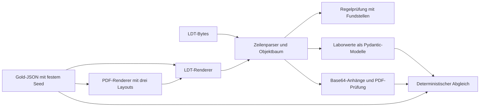

# Lösung: Tag 1 – LDT und synthetische Befunde

Die Lösung von der [ursprünglichen Aufgabenstellung](../README.md).
Code, Tests, Dokumentation und erzeugte Daten liegen in diesem Ordner.
Die bereitgestellten KBV-Dateien und die Spezifikation liegen unter `engineering-hospitation/data/`
und `engineering-hospitation/docs/`. Es werden ausschließlich fiktive KBV- und synthetische Daten verwendet.

## Ergebnisse

### Setup in fünf Befehlen

Im Verzeichnis `loesung/` ausführen (Python 3 mit pip vorausgesetzt):

```sh
python3 -m pip install --user uv
python3 -m uv sync --locked
cp -n .env.example .env
python3 -m uv run pytest
python3 -m uv run python -m src.check_tag1
```

uv stellt Python 3.12 und `.venv` bereit; `uv.lock` fixiert die Abhängigkeiten.
In der IDE `loesung/.venv/bin/python` wählen.

### Stand von Tag 1

- LDT-Zeilenrahmen und Byte-Längen prüfen, ISO-8859-15 dekodieren.
- Satz-/Objektgrenzen prüfen; Reihenfolge, Wiederholungen und Quellzeilen erhalten.
- Relevante Feldpositionen, Vorkommenshierarchien, Pflichtfelder, Werte und
  Kontextregeln prüfen; Abweichungen mit Regel und Fundstelle melden.
- Klinisch-chemische Laborwerte aus `Obj_0060` samt Referenzbereichen und Flags
  extrahieren. Rohwerte einschließlich Komma und Vergleichszeichen bleiben erhalten.
- Eingebettete PDFs objektweise Base64-dekodieren und auf Lesbarkeit prüfen.
- 18 Gold/LDT/PDF-Paare deterministisch erzeugen und gegenprüfen.

Die Regelprüfung ist ein dokumentierter Ausschnitt des LDT-Standards, keine
KBV-Zertifizierung. Die unterstützten Bereiche und verbleibenden Grenzen stehen
unten und in den [Lesenotizen](docs/ldt-notizen.md).

### Architektur



| Datei | Aufgabe |
| --- | --- |
| `src/ldt_sparser.py` | Zeilen und verschachtelte Sätze/Objekte lesen |
| `src/ldt_regeln.py` | Nachgeschlagene Feldhierarchien und Objekttabellen |
| `src/ldt_validator.py` | Validierung mit Regel, Objektpfad und Zeilennummer |
| `src/ldt_extractor.py` | Laborwertmodelle, Extraktion, Anhangsprüfung und CLI |
| `src/laborwert_schema.py` | Gemeinsames Pydantic-Schema für LDT- und PDF-Laborwerte |
| `src/pdf_llm_extractor.py` | PDF-Extraktion per LLM Structured Output |
| `src/normalizer.py` | Deterministische LOINC- und Einheiten-Normalisierung |
| `src/plausibility.py` | Plausibilitätsregeln und LDT/PDF-Widerspruchsprüfung |
| `src/eval_pdf.py` | Evaluation von PDF-Extraktion und Normalisierung gegen Gold |
| `src/generate_dataset.py` | Gold zuerst, dann LDT und PDF erzeugen |
| `src/check_tag1.py` | Gespeicherte Artefakte gegen Gold prüfen, KBV-PDFs extrahieren |

### Nachvollziehbare Prüfzahlen

Ergebnis von `python3 -m uv run python -m src.check_tag1`:

| Prüfung | Ergebnis |
| --- | ---: |
| Synthetische Befunde | 18 |
| Laborwerte | 144 |
| PDF-Layouts | 3 (je 6 Befunde) |
| Mehrseitige Befunde | 3 (insgesamt 21 Seiten) |
| Zusätzliche Scan-Simulationen | 3 |
| Absichtlich fehlerhafte LDTs | 3, alle erwarteten Fehler erkannt |
| Unerwartete Abweichungen im Gold-Abgleich | 0 |
| KBV-Dateien verarbeitet | 6 |
| KBV-PDFs extrahiert | 5 |
| Klinisch-chemische Werte aus KBV-Dateien | 8 |

Der [Prüfbericht](reports/tag1-pruefung.json) enthält die Ergebnisse je Befund.
Der Abgleich prüft Werte, Einheiten, Referenzen und Flags sowie die bytegenaue
Gleichheit zwischen eingebettetem und separat gespeichertem PDF. Der PDF-Text
wird auf der im Gold angegebenen Seite nach Analyt, Wert und Einheit geprüft;
das ist keine Messung einer unabhängigen PDF-Extraktion. Die Tests überprüfen
zusätzlich byteidentische Neugenerierung in zwei getrennten Verzeichnissen.
**Diese Zahlen sind Tag-1-Konsistenzprüfungen, und keine LLM-Evaluation.**

### Befund verarbeiten

```sh
python3 -m uv run python -m src.ldt_extractor ../data/ldt/kbv-testdaten/Z01_UseCase05_Befund_mitPDF.ldt --output data/extrahiert/Z01_UseCase05_Befund_mitPDF
```

Ausgabe: `ergebnis.json` und `anhang_001.pdf`. Alle sechs KBV-Ergebnisse und
fünf PDFs sind bereits unter [data/extrahiert](data/extrahiert) abgelegt.
PDF-Dateinamen werden lokal vergeben; externe LDT-Dateipfade werden nicht geöffnet.
Mehrere Anhänge werden getrennt behandelt. Ungültige Base64-Daten, beschädigte
PDFs oder unbekannte Ergebnisarten werden gemeldet, nicht still ergänzt.

Nur die Validierung ausführen:

```sh
python3 -m uv run python -m src.ldt_validator data/synthetisch/SYN-016/befund.ldt
```

Der absichtlich fehlerhafte Befund liefert K002 und Exitcode 1. Bei fremder oder
fehlender Version bleiben Abweichungen Prüfhinweise; die JSON-Ausgabe muss also
auch bei Exitcode 0 gelesen werden. `vollstaendig: false` bedeutet ausdrücklich,
dass nicht der gesamte Standard implementiert ist. Ungeprüfte Objekttypen werden
aufgelistet, und `review_erforderlich` signalisiert Befunde mit Prüfmeldungen,
unbekannten Objekttypen, nicht unterstützten Ergebnissen oder Anhangsfehlern.

### Synthetischer Datensatz

[data/synthetisch](data/synthetisch) enthält pro `SYN-001` bis `SYN-018`:
`gold.json`, `befund.ldt` und `befund.pdf`. `SYN-004`, `SYN-011` und `SYN-017`
enthalten zusätzlich `befund_scan.pdf` als verschmutzte Bild-PDF. Das Manifest
enthält Layouts, Seitenzahlen, Fehlerfälle und SHA-256-Prüfsummen.

```sh
python3 -m uv run python -m src.generate_dataset
python3 -m uv run python -m src.check_tag1
```

Der Generator verwendet Seed `20260928`, Decimal-Arithmetik, feste Metadaten
und reproduzierbare PDF-Ausgaben. Er verwendet keine KBV-Stammdaten als Vorlage
und keine LLM-generierten Zahlen. Die synthetischen Referenzbereiche sind
Testfixtures und keine klinischen Empfehlungen.

Enthaltene Varianten:

- Tabellen, Fließtext und zwei Spalten; SYN-006, SYN-012 und SYN-018 mit zwei Seiten.
- Krea/Kreatinin, HbA1c/Hämoglobin A1c, GPT/ALT und weitere Kürzel.
- mg/dl/µmol/l, mg/dl/mmol/l, Prozent/mmol/mol sowie weitere Einheiten.
- Dezimalkomma, `<` und `>`, Flags H/L/+, fehlende Referenzen mit `k.A.` im LDT.
- Ablenkender Schulungstext „Glukose 999 mg/dl“, ausdrücklich kein Messwert.
- Drei zusätzliche Scan-Simulationen als Bild-PDF mit leichter Rotation und Rauschen.
- SYN-016: fehlende Ergebniseinheit → K002.
- SYN-017: zusätzliches Flag direkt im Ergebnisobjekt → FELDPOSITION.
- SYN-018: doppelte Ergebnis-ID im selben Objekt → VORKOMMEN.

Die letzten zwei Fehler lösen zusätzlich einen Reihenfolgefehler aus. Gold und PDF
enthalten den beabsichtigten Befund; bei den drei negativen Fällen wird nur das LDT
gezielt verändert. `absichtliche_fehler` dokumentiert diese Ausnahme. Insbesondere
wird die fehlende LDT-Einheit bei SYN-016 nicht aus dem PDF oder Referenzbereich
„repariert“. Die Scan-PDFs sind Zusatzartefakte; LDT und Gold verweisen weiter
auf die sauberen PDFs, damit der deterministische Gold-Abgleich stabil bleibt.

### Entscheidungen und Grenzen

- Parsing, Datengenerierung und Validierung sind deterministisch. Ein LLM wird
  dafür nicht benötigt; Normalisierung und medizinische Plausibilität folgen an Tag 2.
- Die eigenen Dateien deklarieren LDT 3.2.15. Alle gelieferten KBV-Dateien nennen
  3.2.19; die beiliegende Spezifikation beschreibt 3.2.15. Versionsabhängige
  Abweichungen sind daher keine bestätigten Laborfehler der KBV-Dateien.
- Die Regelprüfung deckt die verwendeten Satzarten, klinisch-chemischen Ergebnisse,
  Normalwerte, Anhänge sowie die Metadatenobjekte der synthetischen Befunde ab.
  Feldzugehörigkeit und Reihenfolge werden auch dort geprüft. Implementierte
  Kontextregeln umfassen K001/K002/K009/K043–K048/K053/K054/K055/K075/K076/
  K082/K096/K099/K104/K106/K107; dazu relevante Wertetabellen, Datums-/Zeitformate,
  Feldlängen und E157. Es ist keine vollständige Umsetzung aller Abrechnungs-,
  Spezialfachgebiets- und Kontextregeln des 186-seitigen Standards.
- Allgemeine Leerfeldprüfungen melden auch Fälle, deren spezielle Ausnahmeregel
  noch nicht implementiert ist. Solche Befunde müssen geprüft werden.
- Mikrobiologie, Zytologie, sonstige Untersuchungsergebnisse und Blutgruppen
  werden nicht in numerische Laborwerte umgedeutet. Nicht unterstützte Typen
  sind im Ergebnis sichtbar; Anhänge werden trotzdem extrahiert.
- Der Parser beendet die Verarbeitung bei beschädigten Zeilen-/Objektgrenzen.
  Fachliche Befunde werden gesammelt; Werte werden mit Herkunft und Meldungen
  ausgegeben, nicht als automatisch freigegebene medizinische Ergebnisse.
- Die Testdaten können die implementierten Regeln prüfen, ersetzen aber keine
  unabhängige KBV-Konformitätsprüfung. Die PDF-Renderer sind bisher durch
  Seiten-/Textprüfungen geprüft, nicht durch eine manuelle visuelle Abnahme.

Naechster fachlicher Schritt ist Tag 2: LLM-Vergleich, Normalisierung,
Plausibilitaet und Varianten-Evaluation. Tag 3 bleibt fuer API, React-Review
und Demo vorgesehen.

## Start Tag 2: PDF-Extraktion mit Structured Output, Normalisierung, Plausibelisierung und Evals
### PDF-Extraktion
`src/laborwert_schema.py` definiert das gemeinsame Pydantic-Schema für LDT-
und PDF-Ergebnisse: Analyt wie gedruckt, Wert, Einheit, Referenzbereich, Flag,
Seite, Confidence und Begründung. Fehlende Angaben werden als `null` oder leere
Listen modelliert, damit das Modell nichts erfinden muss.

`src/pdf_llm_extractor.py` liest den PDF-Text seitenweise mit `pypdf`. Im Projekt wurde dafür
tatsächlich OpenRouter mit `anthropic/claude-sonnet-4` verwendet:

```env
OPENAI_BASE_URL=https://openrouter.ai/api/v1
LLM_BASE_URL=https://openrouter.ai/api/v1
LLM_MODEL=anthropic/claude-sonnet-4
```

Der Code unterstuetzt zwei Structured-Output-Wege: zuerst `response_format` mit
dem Pydantic-Modell, danach als Fallback einen strikt schema-gebundenen
Tool-Call. Dieser Fallback war für Claude über OpenRouter nötig, weil der
Provider den direkten `response_format`-Request abgelehnt hat. Der Prompt
verbietet Normalisierung, Umrechnung und das Erfinden fehlender Werte.


### Normalisierung

`src/normalizer.py` normalisiert die bekannten Tag-1-Analyte deterministisch:
laborinterne Kürzel und Synonyme werden auf einen kanonischen Analyt, einen
LOINC-Code und eine Zieleinheit gemappt. Werte bleiben als Original erhalten;
zusätzlich wird ein normalisierter Zahlenwert berechnet, wenn Analyt, Einheit
und numerischer Wert eindeutig sind.

| Analyt | Synonyme/Kürzel | LOINC | Zieleinheit |
| --- | --- | --- | --- |
| Kreatinin | Krea, Kreatinin | 2160-0 | mg/dl |
| Glukose | Glucose, Glukose | 2345-7 | mg/dl |
| HbA1c | HbA1c, Hämoglobin A1c | 4548-4 | % |
| ALT | GPT, ALT | 1742-6 | U/l |
| Natrium | Na, Natrium | 2951-2 | mmol/l |
| Kalium | K, Kalium | 2823-3 | mmol/l |
| CRP | CRP, C-reaktives Protein | 1988-5 | mg/l |
| TSH | TSH, Thyreotropin | 3016-3 | mU/l |

Bewusste Entscheidung: Diese Normalisierung gehört primär in deterministischen
Code, weil Synonyme, LOINC-Codes und Umrechnungsfaktoren auditierbar und
reproduzierbar sein müssen. Ein LLM soll keine Codes oder Faktoren erfinden.
Sinnvoll ist ein LLM nur als Fallback für unbekannte Kürzel: Es darf dann einen
Vorschlag mit Begründung liefern, der in die Mappingtabelle übernommen werden
muss, bevor er produktiv wirkt. Aktuell markiert der Normalizer unbekannte
Analyte mit `llm_fallback_erforderlich`.

Beispiel:

```sh
python3 -m uv run python -m src.normalizer data/synthetisch/SYN-001/pdf_llm.json --output data/synthetisch/SYN-001/pdf_normalisiert.json
```

## Plausibilitätsregeln

`src/plausibility.py` prüft aktuell vier regelbasierte Klassen:

- Wert ausserhalb des Referenzbereichs und Laborflag passt nicht dazu.
- Physiologisch unmögliche Werte anhand grober, bewusst konservativer Grenzen.
- Einheit passt nicht zum Analyt bzw. ist nicht in der deterministischen Tabelle freigegeben.
- LDT und eingebettetes PDF widersprechen sich nach Normalisierung.

Die Regeln sind absichtlich deterministisch: Sie sollen reproduzierbare
Review-Hinweise erzeugen und keine medizinische Diagnose stellen. Für den
LDT/PDF-Vergleich wird nach Ergebnis-ID gematcht, falls vorhanden; sonst nur bei
eindeutigem kanonischem Analyt. Numerische Vergleiche verwenden eine kleine
Toleranz, damit Rundungsdifferenzen aus Einheitenumrechnungen nicht als
Widerspruch zaehlen.

Beispiel:

```sh
python3 -m uv run python -m src.ldt_extractor data/synthetisch/SYN-001/befund.ldt --output data/synthetisch/SYN-001/ldt_extract

python3 -m uv run python -m src.plausibility data/synthetisch/SYN-001/ldt_extract/ergebnis.json --pdf-json data/synthetisch/SYN-001/pdf_llm.json --output data/synthetisch/SYN-001/plausibilitaet.json
```

## Evaluation

`src/eval_pdf.py` vergleicht PDF-Extraktion und Normalisierung gegen `gold.json`.
Gemessen werden Precision/Recall je Feld (`analyt`, `wert`, `einheit`,
`referenz`, `flag`, `seite` und Exact Match für Wert+Einheit) sowie für die
Normalisierung (`loinc`, `ziel_einheit`). Der Report enthält Gesamtzahlen und
Details pro Befund.

Verglichene Varianten:

| Variante | Befunde | Wert+Einheit Precision/Recall | LOINC Precision/Recall | Ziel-Einheit Precision/Recall |
| --- | ---: | ---: | ---: | ---: |
| `regel_text_pdf` | 18 | 0.8125 / 0.8125 | 0.8125 / 0.8125 | 0.8125 / 0.8125 |
| `llm_structured_text` | 18 | 1.0000 / 1.0000 | 1.0000 / 1.0000 | 1.0000 / 1.0000 |
| `scan_ocr_llm` | 3 | 1.0000 / 1.0000 | 1.0000 / 1.0000 | 1.0000 / 1.0000 |

```sh
python3 -m uv run python -m src.eval_pdf --output reports/tag2-evaluation.json
```

Der aktuelle [Eval-Report](reports/tag2-evaluation.json) nutzt für die LLM-
Variante die gespeicherten Claude/OpenRouter-Ausgaben. Die regelbasierte
Baseline und die LLM-Variante wurden beide auf allen 18 Befunden ausgeführt.
`SYN-018` wurde nach einem hängenden Standardlauf mit der kurzen Prompt-Variante
erfolgreich extrahiert.

Fehleranalyse:

- `regel_text_pdf`: 27 fehlende und 27 zusätzliche Werte. Ursache ist das
  zweispaltige Layout: Die einfache Regex-Baseline liest umbrochene Zeilen und
  Spalten nicht stabil genug. Tabellen- und einfache Fliesstextbefunde gelingen.
- `llm_structured_text`: Auf allen 18 Befunden keine Feldfehler. Der
  Ablenkungstext `Glukose 999 mg/dl` wird ignoriert. Beim zweitseitigen
  `SYN-018` war die kurze Prompt-Variante stabiler als der Standardprompt.
- `scan_ocr_llm`: Die drei verschmutzten Scan-PDFs laufen durch die Kette
  `befund_scan.pdf -> OCR -> Structured LLM Extraction -> Normalisierung ->
  Plausibilitaet/Eval`. Lokal ist kein Tesseract installiert; deshalb erzeugt
  `src/scan_ocr.py` für die selbst generierten Scan-PDFs eine deterministische
  OCR-Simulation aus den Gold-Daten. Wenn Tesseract verfügbar ist, nutzt das
  Modul echte OCR über gerenderte PDF-Seiten. Die aktuellen Zahlen messen also
  die Downstream-Kette nach OCR, nicht die Qualität einer realen OCR-Engine.
- Normalisierung: Wenn die PDF-Extraktion stimmt, stimmen LOINC und Zieleinheit
  für die bekannten Testanalyte deterministisch. Fehler entstehen daher zuerst
  durch verfehlte oder zusätzliche PDF-Werte, nicht durch die Mappingtabelle.

Scan-Beispiel:

```sh
python3 -m uv run python -m src.scan_ocr data/synthetisch/SYN-004/befund_scan.pdf --output data/synthetisch/SYN-004/scan_ocr.json

python3 -m uv run python -m src.eval_pdf --run-llm --output reports/tag2-evaluation.json
```
